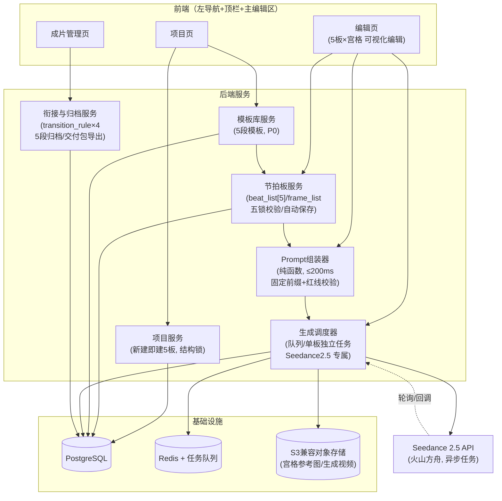
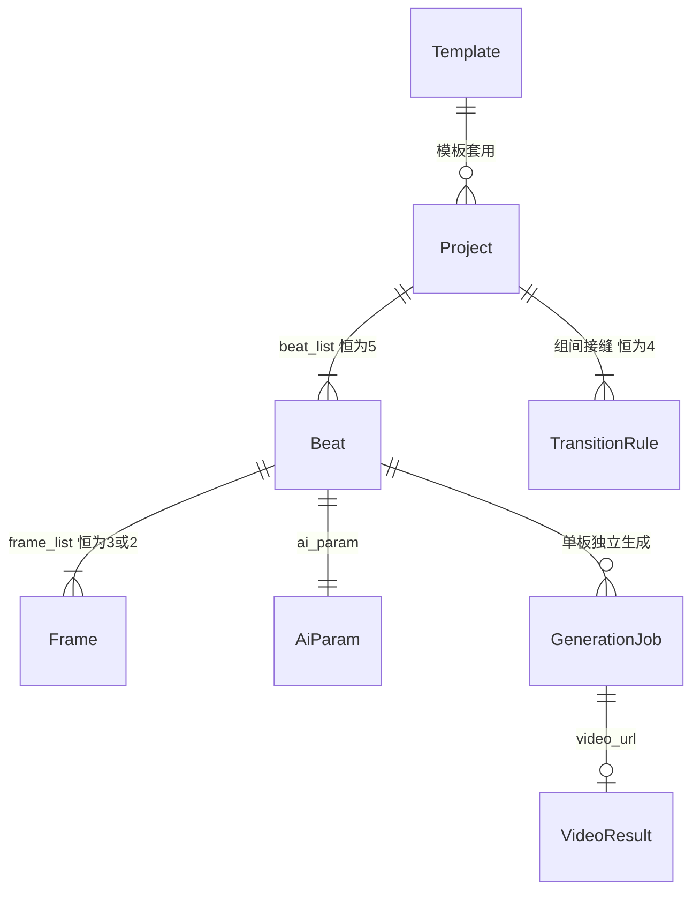

# 产品架构：Seedance 2.5 专属 AI 短剧/漫剧节拍板工业化生产工具

> **文档编号**：00-product-architecture
> **产出槽位**：Wave 1 / Cycle 1 / P1（架构与方案）
> **状态**：v1 修订版（已按源稿全文要点核验修订；v0 为源稿缺失推导稿）
> **最后更新**：2026-08-27

---

## 源稿状态声明

两份源稿的**全文要点已由调度注入**（2026-08-27），本文档 v1 已据此修订，v0 中与源稿冲突的推导设计（自由节拍数、场次/镜头分层、拖拽排序、LLM 拆解、审片间、时间线剪辑等）已全部废除：

1. 《Seedance2.5｜AI漫剧专属 极简节拍板工业化体系（最终纯净终稿）》——工作流、公式、宫格、衔接、Prompt 填充公式已注入；
2. 《PRD｜Seedance2.5 专属AI短剧节拍板工业化生产工具（正式终稿）》——痛点、P0 能力、验收、系统锁、NFR、页面规范要点已注入。

**PDF 原件仍未入库**（建议入 `docs/source/`）。要点未覆盖的细节（PRD 第 11–13 章完整页面规范、5 段模板库具体文案、成品示例全文）仍列于 [§9 待核验清单](#9-待核验清单)。

---

## 0. 源稿红线（最高约束，任何设计与实现不得违反）

1. **核心公式**：`1 剧情节拍 (Beat) = 1 镜头组 (G) = 1 块节拍板 = 1 次 Seedance 2.5 长段落生成`。**废弃传统分镜/故事板工作流**——不存在独立的"镜头（Shot）"实体，不存在逐镜头生成。
2. **单集固定 5 段结构**（不可增、不可删、不可改序）：
   - Beat1 开篇钩子 → Beat2 矛盾建立 → Beat3 打压升级 → Beat4 反转蓄力 → Beat5 断集留客。
3. **宫格固定**：Beat1–4 固定 **3 宫格**，Beat5 固定 **2 宫格**（全集共 14 格）；宫格时序**左→右**，禁止增删改序。
4. **AI 权限边界**：**组内**（一块节拍板内部）运镜与剪辑由 AI（Seedance 2.5）完成；**组间**（板与板之间）衔接由**人工**完成，衔接手法枚举：音频预接 / 螺口 / 卡点硬切 / BGM 升调 / 黑屏断钩子。**Prompt 中禁止包含任何组间衔接内容。**
5. **时长锁**：单板 ≤ 30 秒；成片 70–90 秒短剧。
6. **模型锁**：仅适配 Seedance 2.5，不做多模型抽象层的产品化暴露。
7. **系统五锁**（PRD）：结构锁（5 板不可增删）、工序锁（Step1→Step5 顺序）、时序锁（宫格左→右）、AI 权限锁（组内 AI / 组间人工）、时长锁（单板 ≤30s）。
8. **页面锁**：全局布局为 左导航 + 顶栏 + 主编辑区；仅三页：项目页 / 编辑页 / 成片管理页。
9. **数据锁**：核心数据结构为 `project + beat_list[5] + frame_list + ai_param + transition_rule + prompt_final + video_url`。

## 1. 产品愿景

**一句话**：废弃分镜/故事板，以"剧情节拍"为唯一生产单元，把 AI 短剧/漫剧生产压缩为"5 块节拍板 → 5 次长段落生成 → 4 处人工衔接"的固定流水线。

**PRD 痛点（源稿）**：

| 痛点 | 说明 |
| --- | --- |
| 工序冗余 | 传统"剧本→分镜→逐镜生成→剪辑"链路长、角色多、信息层层转译 |
| 割裂 30s 长段落能力 | 逐镜头生成把 Seedance 2.5 的 30 秒长段落连贯生成能力切碎，白白放弃组内运镜/剪辑的模型内生能力 |
| 节奏不可控 | 自由分镜导致每集节奏随人漂移，无法保证钩子/反转/断集的固定爽点位 |
| 无法量产 | 无固定结构与工序，产能不可预测、不可复制 |

**核心壁垒（源稿）**：**情节驱动，而非镜头驱动**。竞品做"更好的分镜工具"，本产品直接取消分镜——节拍板既是创作单元、又是生成单元、又是交付单元。

## 2. 目标用户

单人创作者即可跑通全流程（定节拍→填节拍帧→生成→衔接合成）。产品不设多岗位分工与协作权限体系（v0 曾设计六角色 RBAC，与源稿"极简工业化"定位冲突，已废除；多人协作不在 P0 范围）。

## 3. 核心工作流（源稿 Step1–Step5，工序锁定不可跳步）

```
Step1 定节拍 ──► Step2 定镜头组 ──► Step3 填节拍帧 ──► Step4 AI生成 ──► Step5 后期合成
（5段模板）      （1 Beat=1 G）      （3/3/3/3/2宫格）    （单板≤30s）     （组间人工衔接）
```

### Step1 定节拍

- 新建项目即**自动创建 5 块节拍板**（结构锁：不可增删、不可改序），板位与叙事职能一一绑定：

| 板位 | 叙事职能 | 宫格数 |
| --- | --- | --- |
| Beat1 | 开篇钩子 | 3 |
| Beat2 | 矛盾建立 | 3 |
| Beat3 | 打压升级 | 3 |
| Beat4 | 反转蓄力 | 3 |
| Beat5 | 断集留客 | 2 |

- 可从 **5 段模板库**（P0 能力）套用模板预填各板剧情核心（源稿成品示例：宴会—钻戒—打压—反转—断集）。
- 完成判据：5 板的剧情核心一句话全部填写。

### Step2 定镜头组

- 按核心公式，每个 Beat 即一个镜头组 G，**不做组内分镜设计**——组内运镜与剪辑属于 AI 权限（由 `ai_param` 中的镜头节奏参数向 Seedance 2.5 表达）。
- 本步骤只确定每板的：目标时长（≤30s，5 板合计落在 70–90s）、情绪基调、镜头节奏档位。
- 完成判据：5 板时长合计 ∈ [70, 90] 秒（时长锁校验）。

### Step3 填节拍帧（宫格图文）

- 每板按固定宫格数填**节拍帧**（frame）：每格 = 参考图（可选）+ 文字描述（该时段的画面要点），时序左→右（时序锁：格不可增删、不可换位）。
- 节拍帧是"节拍帧驱动生成"（P0 能力）的输入：宫格图作为参考素材、宫格文按时序并入 Prompt。
- 完成判据：全部 14 格文字描述非空（参考图可缺省）。

### Step4 AI 生成（单板独立生成）

- **Prompt 自动组装**（P0 能力，NFR：≤200ms）。填充公式（源稿）：

```
prompt_final = 固定前缀 + 情绪 + 时长 + 镜头节奏 + 剧情核心（+ 节拍帧逐格描述，左→右）
```

- **固定前缀**（通用画风人物稳定前缀，源稿）：漫剧厚涂、8K、五官稳定（前缀内容项目级配置、注入不可跳过——验收项"Prompt 含画风人物稳定前缀与红线"）。
- **红线校验器**：组装后自动检查 Prompt **不含任何组间衔接词**（音频预接/螺口/卡点/转场等词表），含则拒绝提交。
- 每板一次 Seedance 2.5 长段落生成任务（异步队列）；单板可独立生成/独立重roll，不影响其他板（验收项"单板≤30s独立生成"）。
- **生成中锁编辑**（PRD 页面规范）：该板处于生成中时其宫格与参数只读。
- **失败三类提示**（PRD）：参数错误（本地可改）/ 模型拒绝（内容调整）/ 系统异常（可重试），分类映射自 API 错误码。
- 完成判据：5 板均有已接受的 `video_url`。

### Step5 后期合成（组间人工衔接）

- 4 个组间接缝（B1|B2、B2|B3、B3|B4、B4|B5）各选定一种**人工衔接手法**（`transition_rule`）：音频预接 / 螺口 / 卡点硬切 / BGM 升调 / 黑屏断钩子。
- 工具职责边界：**管理与归档，不做 AI 拼接**——输出 5 段视频归档 + 衔接清单（每个接缝的手法与操作要点），人工在剪辑软件完成最终合成（AI 权限锁：组间衔接绝不交给模型）。
- 完成判据：成片管理页呈现"5 段归档 + 4 条衔接规则"完整交付包（验收项"成片5段归档"）。

### 贯穿全流程的页面行为（PRD 第 11–13 章要点）

- **自动保存**：编辑页所有输入即时持久化；
- **重置不清结构**：任何"重置"只清空板内内容（帧/参数/Prompt/结果），5 板结构与板位职能永不重建；
- **性能**：编辑页打开 ≤1s，Prompt 组装 ≤200ms，生成走队列异步。

## 4. 模块图与页面结构

### 页面结构（页面锁：左导航 + 顶栏 + 主编辑区）

| 页面 | 主编辑区内容 |
| --- | --- |
| 项目页 | 项目列表/新建（新建即自动 5 板）、模板套用入口 |
| 编辑页 | 5 块节拍板横向排列（Step1–4 全部操作在此完成）：每板含职能标签、宫格区（3/3/3/3/2）、情绪/时长/镜头节奏参数、Prompt 预览、生成按钮与状态 |
| 成片管理页 | 5 段视频归档、4 条衔接规则清单、导出交付包 |

### 模块图



**模块边界要点**：

- **Prompt 组装器（S4）是最高杠杆模块**：无 I/O 纯函数，严格实现填充公式与固定前缀注入，内置红线校验（组间衔接词表拒绝）；≤200ms 由"纯同步函数"天然保证，可同构地跑在前端（即时预览）与后端（提交前终校）。组装规则版本化，`prompt_final` 与版本号一并快照存档。
- **节拍板服务（S2）是五锁的唯一执行点**：结构锁/时序锁/时长锁在服务端强制（API 层面不存在"增删板/增删格/换序"的端点），前端只是同样规则的预校验。
- **生成调度器（S5）仅适配 Seedance 2.5**（模型锁）：不做多供应商产品化抽象；内部保留薄客户端封装仅为可测试性（mock）。生成中置板级编辑锁，完成/失败回写状态与三类错误分类。
- ~~LLM 剧本拆解服务~~、~~审片服务~~、~~时间线剪辑服务~~（v0 设计）：**已废除**——不在 PRD P0 能力（5段模板库、节拍板可视化编辑、Prompt自动组装、节拍帧驱动生成、组间衔接管理）之内，且与"废弃分镜/组间人工"红线冲突。

## 5. 技术栈建议

| 层 | 选型 | 理由 |
| --- | --- | --- |
| 前端 | Next.js (React 19) + TypeScript + Tailwind CSS | 编辑页打开 ≤1s（SSR + 路由预取）；宫格/板卡重交互 |
| 状态管理 | TanStack Query + Zustand | 自动保存（防抖变更队列）与服务端状态分离 |
| 后端 | Node.js + NestJS + TypeScript | 与前端共享类型：五锁校验、节拍板 Schema、Prompt 组装器同构复用 |
| API 风格 | REST + OpenAPI（生成状态 SSE 推送） | 契约先行；端点集合本身体现结构锁（无增删板端点） |
| 数据库 | PostgreSQL + Prisma | 固定结构（1 项目→5 板→14 格）关系清晰；JSONB 存 `ai_param` 与 `prompt_final` 快照 |
| 队列 | Redis + BullMQ | 生成任务队列（NFR 明确要求队列）：并发/重试/限流 |
| 对象存储 | S3 兼容（火山引擎 TOS / MinIO 自托管） | 宫格参考图需公网 URL 供 Seedance 拉取；生成视频落盘归档 |
| 测试 | Vitest（组装器快照/五锁规则单测）+ Playwright（E2E） | 五锁与红线校验是重点测试对象；测试标准不降级 |
| Monorepo | pnpm workspaces + Turborepo | `apps/web + apps/api + packages/*` 统一管理 |
| 部署 | Docker Compose（P0）→ 按需演进 | 先跑通固定流水线 |

> v0 曾列入 dnd-kit（看板拖拽排序）、LLM 适配层（剧本拆解）、FFmpeg（时间线粗剪）——分别与时序锁、P0 范围、组间人工衔接冲突，**已移除**。

## 6. 目录结构建议

```
jiepaiban/
├── docs/
│   ├── architecture/               # 架构文档（本文件等）
│   ├── handoff/                    # 槽位交接文档
│   └── source/                     # 源稿 PDF 入库位置（原件待入库）
├── apps/
│   ├── web/                        # Next.js 前端
│   │   └── src/
│   │       ├── app/
│   │       │   ├── projects/       # 项目页
│   │       │   ├── editor/[id]/    # 编辑页（5板×宫格）
│   │       │   └── archive/[id]/   # 成片管理页
│   │       └── features/           # beatboard / prompt-preview / generation / transition
│   └── api/                        # NestJS 后端
│       └── src/
│           ├── modules/
│           │   ├── project/        # 项目服务 (S1)
│           │   ├── beatboard/      # 节拍板服务 + 五锁校验 (S2)
│           │   ├── template/       # 5段模板库 (S3)
│           │   ├── generation/     # 生成调度器 (S5)
│           │   └── delivery/       # 衔接与归档 (S6)
│           └── workers/            # 队列消费者：生成轮询、结果落盘
├── packages/
│   ├── shared/                     # 共享类型、五锁常量、节拍板/节拍帧 Schema、错误三分类
│   ├── prompt-assembler/           # Prompt 组装器 (S4)：填充公式+前缀注入+红线校验，纯函数+快照测试
│   └── seedance-client/            # Seedance 2.5 客户端（类型化、可 mock）
├── infra/docker-compose.yml        # Postgres + Redis + MinIO
├── .github/workflows/              # CI：lint + typecheck + test
└── package.json / pnpm-workspace.yaml / turbo.json
```

## 7. 关键实体（严格对应源稿数据锁）

源稿数据结构 → 存储模型映射：



| 实体 | 对应源稿字段 | 关键字段（摘要） |
| --- | --- | --- |
| Project | `project` | 名称、画风固定前缀配置（默认：漫剧厚涂/8K/五官稳定）、目标总时长（70–90s）、状态 |
| Beat | `beat_list[5]` | `beat_index (1–5, 唯一且不可变)`、职能（枚举，随 index 恒定：钩子/矛盾/打压/反转/断集）、剧情核心、情绪、时长（≤30s）、状态（草稿/待生成/生成中/已生成/失败） |
| Frame | `frame_list` | `frame_index（板内 1–3 或 1–2，不可变）`、文字描述、参考图 URL（可空） |
| AiParam | `ai_param` | 镜头节奏档位、分辨率/宽高比等 Seedance 参数、组内运镜提示（AI 权限范围内） |
| PromptFinal | `prompt_final` | 组装产物全文快照、组装器版本、红线校验结果、组装耗时 |
| GenerationJob / VideoResult | `video_url` | 供应商任务 ID、请求体快照、状态、错误三分类、视频 URL、时长、是否采纳 |
| TransitionRule | `transition_rule` | 接缝位置（1|2、2|3、3|4、4|5，恒 4 条）、手法（枚举 5 种：音频预接/螺口/卡点硬切/BGM升调/黑屏断钩子）、操作要点备注 |
| Template | （P0 模板库） | 5 段剧情核心预填文案、适用题材标签 |

**设计不变量（五锁的数据层表达）**：

1. **结构锁**：`Beat` 随项目创建固定生成 5 行，无创建/删除 API；`(project_id, beat_index)` 唯一。
2. **时序锁**：`Frame` 随 Beat 固定生成（3/3/3/3/2），`frame_index` 不可变，无换序 API。
3. **工序锁**：Beat 状态机只允许 `草稿→待生成→生成中→已生成/失败` 及"重置回草稿"（重置只清内容不动结构）。
4. **AI 权限锁**：`transition_rule` 与生成链路零交集——组装器对衔接词表硬校验，衔接数据不进入任何 Prompt。
5. **时长锁**：`Beat.duration ≤ 30`（DB CHECK + 服务端校验）；提交生成前校验 5 板合计 ∈ [70, 90]。
6. 生成快照不可变：`prompt_final` 与请求体随任务落库，模板/前缀后续修改不影响历史任务复现。

## 8. Seedance 2.5 能力边界（公开资料 2026-08，接入前以火山方舟官方文档复核）

| 能力项 | 公开资料值 | 与本产品的对应 |
| --- | --- | --- |
| 官方模型 ID | `doubao-seedance-2-5-260628` | seedance-client 配置项（模型锁：唯一模型） |
| 调用方式 | 异步任务接口（提交→轮询/回调） | 生成调度器队列 + 轮询 worker |
| 分辨率 | 480p / 720p（4K 灰度中） | 项目级 `ai_param` |
| 时长 | 4–30 秒整数 | 与"单板≤30s"时长锁完全吻合——这正是"1板=1次长段落生成"公式成立的能力基础 |
| 宽高比 | 21:9/16:9/4:3/1:1/3:4/9:16/adaptive | 短剧默认 9:16 |
| 参考图 | 最多 30 张 | 宫格参考图（≤3张/板）+ 人物稳定参考注入通道 |
| 同步音频 | `generate_audio` | 组内台词/音效；组间音频衔接仍属人工 |
| 任务类型 | generate / edit / extend | P0 仅用 generate；edit 可作板内返修的后续增强 |
| 生成耗时 | 720p 约 2 分钟/条 | 队列异步 + 生成中锁编辑的依据 |
| 计费 | 按 token（≈时长×宽×高×帧率） | 单板成本可精确预估（固定结构的量产成本模型） |

## 9. 待核验清单

v0 的 13 项核验条目处置结果：

| # | 条目 | 处置 | 依据 |
| --- | --- | --- | --- |
| 1 | 节拍卡字段集合 | ✅ 已修订：废除 v0 11 字段卡，改为 Beat+Frame+AiParam（§7） | 数据锁 + 宫格规范 |
| 2 | 节拍时长规范 | ✅ 单板≤30s、成片70–90s、单集恒 5 板 | 时长锁 |
| 3 | 漫剧/短剧差异 | ✅ 共用流水线，画风前缀不同（漫剧厚涂为默认前缀示例） | 体系稿通用前缀 |
| 4 | 角色分工 | ✅ 废除六角色 RBAC，单人全流程 | 极简工业化定位 |
| 5 | 生产阶段划分 | ✅ 改为 Step1–5（§3），废除 v0 七阶段 | 体系稿工作流 |
| 6 | 质检标准 | ✅ 简化为板级采纳/重roll + 失败三类提示，废除审片间 | PRD 页面规范 |
| 7 | 产能指标 | ⚠️ 源稿要点未含具体数值，保留待原件核验 | — |
| 8 | 功能范围边界 | ✅ P0 五能力锁定（模板库/可视化编辑/Prompt组装/节拍帧驱动生成/衔接管理） | PRD 能力 P0 |
| 9 | 提示词模板写法 | ✅ 填充公式+固定前缀+禁组间衔接（§3 Step4） | 体系稿 |
| 10 | Seedance 参数技巧 | ⚠️ §8 仍为公开资料，需原件+官方文档复核 | — |
| 11 | 发行/分发环节 | ✅ 确认不含：止步于 5 段归档+衔接清单 | PRD 验收 |
| 12 | 商业模式/定价 | ⚠️ 要点未覆盖，待原件 | — |
| 13 | 竞品差异化 | ✅ 情节驱动非镜头驱动 | PRD 壁垒 |

**仍待原件核验（源稿 PDF 入库后处理）**：

- PRD 第 11–13 章完整页面规范（本文档仅有要点：自动保存/生成中锁编辑/失败三类提示/重置不清结构）；
- 5 段模板库的具体模板文案与数量；
- 成品示例全文（宴会—钻戒—打压—反转—断集）作为模板库种子数据；
- 产能指标数值、商业模式（如有）；
- 通用前缀的完整措辞（"漫剧厚涂、8K、五官稳定"是否为全文）。

---

## 附：P0 范围与验收对照（PRD）

| PRD 验收项 | 承接设计 |
| --- | --- |
| 新建自动 5 板、不可增删 | §7 不变量 1；项目服务建项即建板 |
| 宫格图文 | §3 Step3 + Frame 实体 |
| Prompt 含画风人物稳定前缀与红线 | §4 Prompt 组装器：前缀强制注入 + 衔接词表校验 |
| 单板 ≤30s 独立生成 | §3 Step4 + 时长锁 + 板级独立任务 |
| 成片 5 段归档 | §3 Step5 + 衔接与归档服务 |
| NFR：打开≤1s / Prompt≤200ms / 队列 | §5 技术栈选型理由列 |
