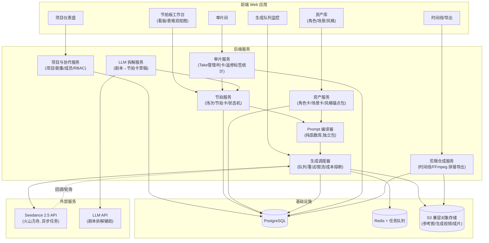
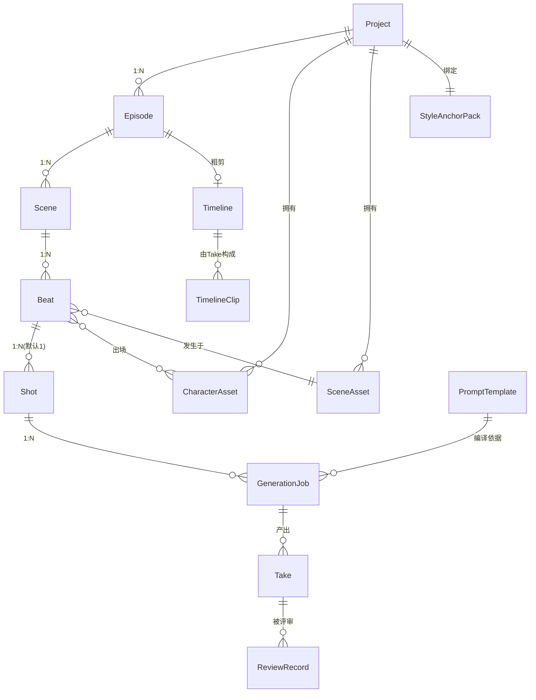

# 产品架构：Seedance 2.5 AI 短剧/漫剧节拍板工业化制作工具

> **文档编号**：00-product-architecture
> **产出槽位**：Wave 1 / Cycle 1 / P1（架构与方案）
> **状态**：初稿（源稿缺失，见下方声明）
> **最后更新**：2026-08-27

---

## ⚠️ 源稿缺失声明

本文档的两份源稿在仓库内**均未找到**（已执行 `git fetch` 并全仓搜索，仓库基线仅含占位 README，无 docs、无 PDF、无代码）：

1. 《Seedance2.5｜AI漫剧专属 极简节拍板工业化体系（最终纯净终稿）.pdf》
2. 《PRD｜Seedance2.5 专属AI短剧节拍板工业化生产工具（正式终稿）.pdf》

因此本文档基于以下三类信息推导出**可执行架构**：

- 源稿**文件名**所揭示的产品定位（Seedance 2.5 专属、AI 短剧/漫剧、极简节拍板、工业化生产工具）；
- 影视/动画行业**节拍板（Beat Board）工业化生产**的通用方法论；
- Seedance 2.5 的**公开 API 资料**（2026-08 火山方舟上线，异步任务接口，详见 §8）。

所有依赖源稿才能确定的细节，已集中列入 [§9 必须用源稿核验的条目](#9-必须用源稿核验的条目)。源稿入库后，须逐条核对并修订本文档。

---

## 1. 产品愿景

**一句话**：把 AI 短剧/漫剧的生产从"手工作坊式抽卡"变成"以节拍板为中枢的工业化流水线"。

当前 AI 短剧生产的痛点：

| 痛点 | 表现 |
| --- | --- |
| 创作与生成脱节 | 剧本写完后，靠人肉在生成工具里逐条写提示词，信息层层丢失 |
| 一致性失控 | 角色长相、场景、画风在集与集、镜头与镜头之间漂移 |
| 产能不可预测 | 抽卡式重试，无法回答"这一集什么时候能交付" |
| 无质检标准 | 通过/重做全凭个人感觉，无法多人协作分工 |
| 资产不沉淀 | 每个项目从零开始，提示词、角色设定、风格配方散落在聊天记录里 |

**本产品的解法**：以"极简节拍卡"作为创作与生成之间的**唯一标准化中间产物**——编剧侧把剧本拆成结构化节拍卡，生成侧由 Prompt 编译器把节拍卡与项目级资产锚点（角色、场景、风格）自动编译为 Seedance 2.5 生成指令，批量提交、批量审片、批量出片。人只做两件事：**填卡**与**判卡**，其余交给流水线。

**北极星目标（待源稿核验具体数值）**：单人日产 1 集以上成片；单集从剧本到成片的周期以小时计；镜头一次通过率可度量、可持续提升。

## 2. 目标用户与角色

工业化体系的前提是分工。系统内置以下角色（RBAC），小团队可一人兼多角色：

| 角色 | 职责 | 主要工作界面 |
| --- | --- | --- |
| 制片人（Producer） | 立项、排期、产能看板、验收成片 | 项目仪表盘 |
| 编剧/节拍师（Beat Writer） | 剧本导入、节拍拆解、填写节拍卡 | 节拍板工作台 |
| 视觉导演（Visual Director） | 定义风格锚点、角色/场景资产、审美终裁 | 资产库 + 审片间 |
| 生成师（Gen Operator） | 编译提示词、发起/重roll生成任务、参数调优 | 生成队列 |
| 审片员（Reviewer/QC） | 按质检清单判卡（通过/返修/重拆） | 审片间 |
| 剪辑（Editor） | 粗剪时间线、导出成片 | 时间线 |

> 短剧（真人质感）与漫剧（动漫/漫画质感）共用同一套流水线，差异体现在**风格锚点包**与**质检清单模板**上（待源稿核验，见 §9）。

## 3. 核心工作流

七阶段流水线，每阶段有明确的输入、输出与完成判据（Definition of Done）：

```
剧本 ──► ①立项与风格锚定 ──► ②节拍拆解 ──► ③节拍板编辑 ──► ④Prompt 编译
                                                                  │
成片 ◄── ⑦粗剪与导出 ◄── ⑥审片质检 ◄── ⑤批量生成（Seedance 2.5）◄──┘
                              │
                              └──(不通过)──► 重roll / 改卡 / 重拆（回②③④）
```

### ① 立项与风格锚定

- 创建项目（短剧/漫剧类型、宽高比、单集目标时长、分辨率档位）。
- 建立**风格锚点包**：画风描述、参考图集、负面清单；建立**角色卡**（形象定妆图 + 特征描述 + 音色参考）与**场景卡**。这些资产后续会被编译器自动注入每个镜头的生成请求（利用 Seedance 2.5 的多参考素材能力，见 §8）。
- 完成判据：锚点包通过视觉导演的"三镜头一致性试产"（同一角色三个不同镜头，人脸/服装/画风不漂移）。

### ② 节拍拆解

- 导入剧本或大纲（纯文本/Markdown/剧本格式）。
- LLM 辅助拆解：把剧本自动切分为**场次（Scene）→ 节拍（Beat）**，每个节拍预填节拍卡草稿；人工校对调整。
- 完成判据：每集节拍总时长 ≈ 目标片长；每个节拍时长落入 Seedance 2.5 单次生成区间（4–30 秒，待核验源稿是否有更严格的"极简"规范，如 3–8 秒/拍）。

### ③ 节拍板编辑（产品核心界面）

- **看板视图**：一列一场次、一卡一节拍，拖拽排序；**表格视图**：批量编辑字段。
- 极简节拍卡字段（v0 提案，**字段集合必须以源稿为准**，见 §9）：

| 字段 | 说明 | 必填 |
| --- | --- | --- |
| 节拍序号 | 集内全局序 | 自动 |
| 节拍意图 | 一句话：这一拍要让观众感到什么/知道什么 | ✅ |
| 画面描述 | 谁在哪做什么（主体+动作+环境） | ✅ |
| 出场角色 | 引用角色卡（多选） | ✅ |
| 场景 | 引用场景卡 | ✅ |
| 景别/运镜 | 枚举：远/全/中/近/特 × 推拉摇移跟固定 | ✅ |
| 时长（秒） | 整数，4–30 | ✅ |
| 台词/音效提示 | 可空；驱动同步音频生成 | – |
| 情绪基调 | 枚举 + 自由文本 | – |
| 首帧参考 | 可选图片（约束构图/接戏） | – |
| 备注 | 给生成师/审片员的自由说明 | – |

- 卡片状态机：`草稿 → 待生成 → 生成中 → 待审 → 通过 / 返修 / 重拆`。
- 完成判据：全部节拍卡进入"待生成"。

### ④ Prompt 编译

- **Prompt 编译器**（独立可测试的纯函数模块）：`编译(节拍卡, 角色卡[], 场景卡, 风格锚点包, 项目参数) → Seedance 2.5 请求体`。
- 职责：字段拼装为提示词（主体/动作/镜头/节奏/光线/声音的结构化描述）、注入参考素材 URL（角色定妆图、场景图、风格图、音色参考）、设置 `resolution / duration / aspect_ratio / generate_audio` 等参数、套用项目级负面清单。
- 编译结果对生成师**可见可改**（人工微调后的差异记录为该镜头的 override，不污染模板）。
- 完成判据：编译产物通过 JSON Schema 校验，且干跑（dry-run）预算估算在项目配额内。

### ⑤ 批量生成

- 任务队列按集/按场次批量提交至 Seedance 2.5 异步任务接口；支持并发上限、失败重试、限流退避、成本熔断（超预算自动暂停）。
- 每个镜头可保留多个 Take（版本），重roll 不覆盖历史。
- 生成完成后自动拉取视频落盘至对象存储，回写卡片状态为"待审"。

### ⑥ 审片质检

- 审片间：按节拍顺序连播 Take，双向对照节拍卡字段。
- 判卡三选一：**通过**（锁定 Take）、**返修**（回④重roll，需填返修原因标签：角色漂移/动作不符/运镜不符/画质/音频/其他）、**重拆**（节拍本身有问题，退回②③）。
- 返修原因标签沉淀为数据，驱动提示词模板与锚点包的迭代（工业化的核心反馈环）。
- 完成判据：单集全部节拍"通过"。

### ⑦ 粗剪与导出

- 通过的 Take 按节拍序自动拼接为时间线；支持微调（裁剪首尾、转场、补字幕轨）。
- 导出成片（mp4，目标平台规格预设：竖屏 9:16 短剧 / 横屏 16:9 等）+ 交付清单（分镜表、素材清单）。

## 4. 模块图



**模块边界要点**：

- **Prompt 编译器（S4）是全系统最高杠杆模块**：无 I/O 的纯函数库，单独成包、单独测试（快照测试 + Schema 校验），编译规则版本化——每次生成记录所用编译器版本，保证可复现与可回溯。
- **生成调度器（S5）是唯一与 Seedance API 对话的模块**：内含供应商适配层（火山方舟直连为主，聚合网关为备），对上暴露统一的 `GenerationJob` 抽象，便于未来接入 Seedance 后续版本或其他模型。
- **审片服务（S6）产生的返修标签数据**回流至资产服务与编译器模板，构成工业化的持续改进闭环。

## 5. 技术栈建议

| 层 | 选型 | 理由 |
| --- | --- | --- |
| 前端 | Next.js (React 19) + TypeScript + Tailwind CSS | 节拍板重交互（拖拽、批量编辑、视频预览）；生态成熟 |
| 拖拽/看板 | dnd-kit | 看板视图核心依赖，轻量可控 |
| 状态管理 | TanStack Query + Zustand | 服务端状态与本地 UI 状态分离 |
| 后端 | Node.js + NestJS（或 Fastify）+ TypeScript | 与前端共享类型（节拍卡 Schema 单一来源）；I/O 密集型场景合适 |
| API 风格 | REST + OpenAPI（生成任务状态用 SSE/WebSocket 推送） | 契约先行，便于多槽位并行开发 |
| 数据库 | PostgreSQL + Prisma | 关系模型清晰（项目→集→场→拍→镜头→Take）；JSONB 存编译产物快照 |
| 队列 | Redis + BullMQ | 生成任务的并发/重试/限流/延迟调度 |
| 对象存储 | S3 兼容（火山引擎 TOS / AWS S3 / MinIO 自托管） | 参考素材需公网可访问 URL 供 Seedance 拉取；预签名 URL 管控 |
| 视频处理 | FFmpeg（服务端 worker） | 粗剪拼接、转码、抽帧缩略图 |
| LLM 拆解 | 豆包/DeepSeek 等，经统一适配层接入 | 剧本→节拍卡草稿；供应商可替换 |
| 部署 | Docker Compose（v0）→ K8s（规模化后） | 先跑通流水线，再谈弹性 |
| Monorepo | pnpm workspaces + Turborepo | 前后端 + 共享包 + 编译器包统一管理 |
| 测试 | Vitest（单测/编译器快照）+ Playwright（E2E） | 编译器与状态机是重点测试对象；测试标准不降级 |

> 备选说明：若团队偏 Python，后端可换 FastAPI + Celery + SQLAlchemy，代价是失去前后端共享 TypeScript 类型的优势。本文档以 TypeScript 全栈为第一建议。

## 6. 目录结构建议

```
jiepaiban/
├── docs/                           # 本目录：架构、PRD 复原、交接文档
│   ├── architecture/               # 架构与设计文档（00- 前缀编号）
│   ├── handoff/                    # 各 Wave/槽位交接文档
│   └── source/                     # 源稿 PDF 入库位置（当前缺失）
├── apps/
│   ├── web/                        # Next.js 前端
│   │   └── src/
│   │       ├── app/                # 路由：dashboard / beatboard / assets / review / timeline
│   │       ├── components/
│   │       └── features/           # 按领域组织：beatboard、assets、review...
│   └── api/                        # NestJS 后端
│       └── src/
│           ├── modules/
│           │   ├── project/        # 项目与协作 (S1)
│           │   ├── beat/           # 节拍服务与状态机 (S2)
│           │   ├── asset/          # 资产服务 (S3)
│           │   ├── generation/     # 生成调度器 + Seedance 适配层 (S5)
│           │   ├── review/         # 审片服务 (S6)
│           │   ├── timeline/       # 剪辑合成 (S7)
│           │   └── breakdown/      # LLM 拆解 (S8)
│           └── workers/            # 队列消费者：生成轮询、FFmpeg 合成
├── packages/
│   ├── shared/                     # 共享类型、节拍卡 JSON Schema、枚举、错误码
│   ├── prompt-compiler/            # Prompt 编译器 (S4)：纯函数库 + 快照测试
│   └── seedance-client/            # Seedance 2.5 API 客户端（类型化、可 mock）
├── infra/
│   └── docker-compose.yml          # Postgres + Redis + MinIO 本地开发栈
├── .github/workflows/              # CI：lint + typecheck + test
├── package.json / pnpm-workspace.yaml / turbo.json
└── README.md
```

## 7. 关键实体

实体关系概览（详细字段与迁移脚本由 W2 数据模型槽位产出）：



| 实体 | 说明 | 关键字段（摘要） |
| --- | --- | --- |
| Project | 项目（一部短剧/漫剧） | 类型(短剧/漫剧)、宽高比、分辨率档、单集目标时长、预算配额 |
| Episode | 剧集 | 序号、状态、目标时长 |
| Scene | 场次 | 序号、地点摘要、关联 SceneAsset |
| **Beat** | **节拍卡（核心实体）** | §3③ 字段表 + 状态机字段；字段集合待源稿核验 |
| Shot | 镜头（节拍的生成单元） | 默认 1 拍 = 1 镜头，允许 1 拍拆多镜头 |
| CharacterAsset | 角色卡 | 名称、特征描述、定妆图集、音色参考、版本 |
| SceneAsset | 场景卡 | 名称、描述、参考图集、版本 |
| StyleAnchorPack | 风格锚点包 | 画风描述、参考图集、负面清单、版本 |
| PromptTemplate | 提示词模板 | 模板体、适用类型（短剧/漫剧）、编译器版本、版本 |
| GenerationJob | 生成任务 | 编译后请求体快照(JSONB)、供应商任务ID、状态、成本、重试次数 |
| Take | 生成结果版本 | 视频URL、缩略图、时长、元数据、是否锁定 |
| ReviewRecord | 审片记录 | 结论(通过/返修/重拆)、返修原因标签、评审人 |
| Timeline / TimelineClip | 粗剪时间线 | 片段序、入出点、转场、导出配置 |

**设计不变量**：

1. 生成任务永远保存**编译产物快照**与**编译器版本**——即使模板后来改了，历史生成可复现。
2. Take 只增不删（软删除），审片"通过"即锁定，粗剪只能引用锁定 Take。
3. 资产（角色/场景/风格/模板）全部带版本号，节拍卡引用的是"资产+版本"。

## 8. Seedance 2.5 能力边界（公开资料，2026-08，须以官方文档与源稿复核）

架构中所有与生成相关的设计受以下能力约束（来源：火山方舟公开 API 文档与第三方接入文档；**接入前必须以火山引擎官方文档逐项复核**）：

| 能力项 | 公开资料值 | 对架构的影响 |
| --- | --- | --- |
| 官方模型 ID | `doubao-seedance-2-5-260628` | seedance-client 包配置项 |
| 调用方式 | 异步任务接口（提交→轮询/回调） | 生成调度器必须做轮询 worker + 可选回调入口 |
| 分辨率 | 480p / 720p（4K 灰度中） | 项目分辨率档位枚举；导出侧考虑超分预留 |
| 时长 | 4–30 秒整数（部分通道支持 `-1` 自适应） | 节拍卡时长字段校验规则 |
| 宽高比 | 21:9 / 16:9 / 4:3 / 1:1 / 3:4 / 9:16 / adaptive | 项目级参数；用首尾帧时须 adaptive |
| 首尾帧 | `image_urls` 最多 2 张（首帧+可选尾帧） | 节拍卡"首帧参考"字段；接戏能力的基础 |
| 参考图 | 最多 30 张 | 角色/场景/风格锚点注入的通道 |
| 参考视频 | 最多 10 段（计入计费时长） | 运镜/表演参考；成本核算须计入 |
| 参考音频 | 最多 10 段 | 角色音色一致性通道 |
| 同步音频 | `generate_audio` 布尔 | 台词/音效提示字段驱动 |
| 任务类型 | generate / edit / extend | 返修可走 edit（时间戳级编辑）而非全量重roll；30 秒以上长镜头走 extend |
| 生成耗时 | 720p 约 2 分钟/条 | 队列并发与产能测算的基础参数 |
| 计费 | 按 token（≈ 时长×宽×高×帧率），输入含视频时单价不同 | 成本熔断与项目配额模块的计费模型 |

## 9. 必须用源稿核验的条目

以下条目本文档基于常识给出了 v0 提案，但**最终以两份源稿为准**。源稿 PDF 入库（建议放 `docs/source/`）后逐条核对，并在本表登记核验结果：

| # | 待核验条目 | 本文档 v0 提案 | 依据源稿 | 状态 |
| --- | --- | --- | --- | --- |
| 1 | 「极简节拍卡」的确切字段集合与必填项 | §3③ 的 11 字段表 | 极简节拍板体系稿 | ⬜ 未核验 |
| 2 | 节拍时长规范（单拍秒数区间、单集节拍数） | 4–30 秒（API 上限），未定"极简"细则 | 极简节拍板体系稿 | ⬜ 未核验 |
| 3 | 漫剧与短剧的流程/字段/风格差异点 | 仅风格锚点包与质检模板不同 | 两份源稿 | ⬜ 未核验 |
| 4 | 工业化角色分工与岗位命名 | §2 的六角色 | 极简节拍板体系稿 | ⬜ 未核验 |
| 5 | 生产阶段划分与各阶段 DoD | §3 的七阶段 | 极简节拍板体系稿 | ⬜ 未核验 |
| 6 | 质检清单的具体检查项与判卡标准 | 返修原因六标签 | 极简节拍板体系稿 | ⬜ 未核验 |
| 7 | 产能/效率指标（北极星指标、日产目标） | "单人日产 1 集"为占位假设 | PRD 稿 | ⬜ 未核验 |
| 8 | PRD 的功能范围边界（哪些功能在/不在首版） | §4 全部模块均列入，未分期 | PRD 稿 | ⬜ 未核验 |
| 9 | 提示词模板的官方写法/结构（若源稿含模板） | 编译器自定结构化拼装 | 两份源稿 | ⬜ 未核验 |
| 10 | Seedance 2.5 的推荐参数与专属技巧 | §8 公开资料 | 两份源稿 + 官方文档 | ⬜ 未核验 |
| 11 | 是否包含发行/分发环节（平台上传、封面、排期） | 未纳入（止步于成片导出） | PRD 稿 | ⬜ 未核验 |
| 12 | 商业模式/定价/配额策略（如有） | 未纳入 | PRD 稿 | ⬜ 未核验 |
| 13 | 竞品对照与差异化主张（如有） | 未纳入 | PRD 稿 | ⬜ 未核验 |

---

## 附：分期建议（供排期参考，非承诺）

- **M0 走通流水线（最小闭环）**：项目/剧集/节拍卡 CRUD + 手动填卡 → 编译器 v0 → 单任务生成 → 简单审片（通过/重roll）→ 顺序拼接导出。不含 LLM 拆解、不含多角色协作。
- **M1 工业化提效**：LLM 拆解、批量生成队列、资产版本化、返修标签统计、看板拖拽。
- **M2 规模化**：多项目产能仪表盘、edit/extend 精修通道、模板市场化沉淀、K8s 部署。
