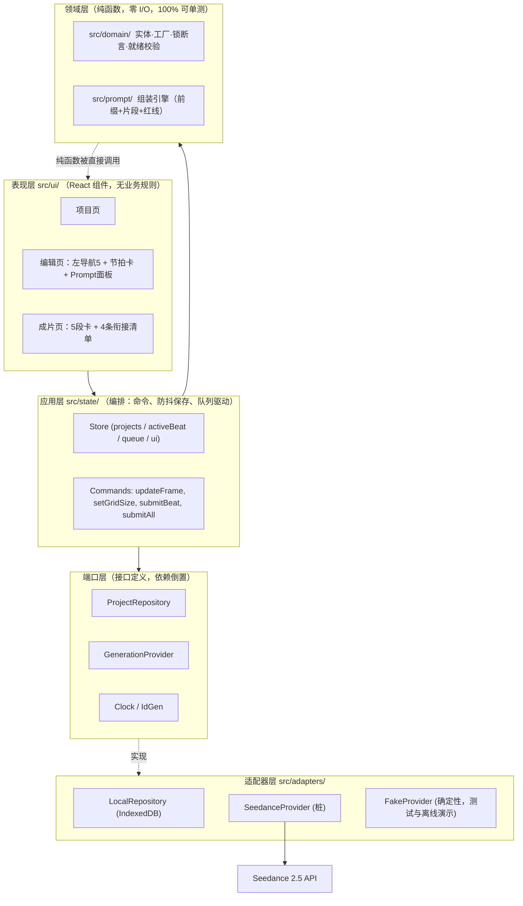

# 系统架构（System Architecture）

> 槽位：Wave 1 / Cycle 1 / **P3**（架构与方案）
> 状态：**v1.0 基线**（本文件为架构族文档的入口，其余四篇为其展开）
> 最后更新：2026-08-27

## 0. 本文档在文档族中的位置

| 文件 | 职责 |
| --- | --- |
| **`system-architecture.md`（本文）** | 系统锁、分层与模块边界、数据流、目录结构、演进路径 |
| [`data-model.md`](./data-model.md) | TypeScript 实体定义与不变量（`beat_list[5]` / `frame_list` 3\|2） |
| [`tech-stack.md`](./tech-stack.md) | 选型与理由（Vite + React + TS + Vitest + Playwright、本地持久化优先、Seedance 适配器桩） |
| [`prompt-engine.md`](./prompt-engine.md) | 前缀 + 片段 + 红线的组装引擎规格 |
| [`../backlog/wave-plan.md`](../backlog/wave-plan.md) | 80 波次排布与 Cycle 1 的 W2–W4 具体任务 |
| [`../backlog/ready-queue.md`](../backlog/ready-queue.md) | 就绪队列与**文件归属**（防并发撞车） |

上游依据：`docs/prd/prd-seedance-tool.md`（PRD 正式版转写）与 `docs/architecture/00-product-architecture.md`（P1 产品架构）。二者与本文的口径差异见 [§8 口径对齐](#8-口径对齐与未决项)。

---

## 1. 系统锁（Locks）——架构层面的不可协商约束

系统锁是本产品"用约束换产能"的工程化落点。**锁不是文档规范，而是类型系统 + 运行时断言 + CI 检查三重固化的机制。**

| 锁 | 名称 | 内容 | 固化手段 |
| --- | --- | --- | --- |
| **L1** | 结构锁 | `beat_list` 长度**恒为 5**，不可增、不可删、不可改序 | 元组类型 `BeatTuple`；无增删 API；`assertLocks` 运行时断言；E2E 断言无增删入口 |
| **L2** | 宫格锁 | `frame_list` 长度 ∈ **{3, 2}**；**B1–B4 = 3 格，B5 = 2 格**（全集 14 格）；时序左→右不可换位 | 联合元组类型 `FrameList`；`FRAME_COUNT_BY_INDEX` 常量表；单测覆盖 |
| **L3** | 时长锁 | **单节拍 ≤ 30 秒**（Seedance 2.5 单次长段落上限） | `Duration` 构造校验；提交前 `readiness` 校验；组装器拒绝越界 |
| **L4** | 无分镜锁 | schema / 类型 / 路由 / UI 文案中**不得出现分镜类实体与字段**（Shot、Storyboard、景别、机位、运镜、分镜） | 类型层无对应实体；CI 关键词扫描（禁用词表）；评审 checklist |
| **L5** | 衔接隔离锁 | `transition_rule`（组间衔接）及 `beat.name`、`beat.memo`**绝不**进入 `prompt_final` 与生成请求体 | 组装器硬排除清单 + 输出断言；CI 必跑红线测试 |
| **L6** | 模型锁 | 仅适配 Seedance 2.5；适配器是**可测试性**边界，不是产品化的多模型开关 | 单 Provider 实现 + Fake 实现；UI 无模型选择器 |
| **L7** | 所见即所发 | 提交给 API 的文本 **=== ** Prompt 面板展示文本（含系统前缀），禁止面板外隐藏注入 | 提交路径复用同一纯函数；E2E 文本一致性断言 |

> **L1–L3 是数据锁**（形状约束），**L4–L5 是内容锁**（禁止项），**L6–L7 是边界锁**（对外一致性）。三类锁的测试分工见 [`../backlog/wave-plan.md`](../backlog/wave-plan.md) 的验证波次定义。

### 1.1 锁的执行点唯一化原则

每条锁**有且只有一个执行点**，其余位置只做"预校验"或"复用"，不得平行实现：

- L1/L2 的唯一执行点是 `src/domain/`（工厂函数 + 不变量断言）；UI 不得自行构造 `beat_list`。
- L3 的唯一执行点是 `src/domain/locks.ts` 的 `assertDuration`；就绪校验与组装器都调用它。
- L5/L7 的唯一执行点是 `src/prompt/assemble.ts`（纯函数）；面板渲染与生成提交**必须调用同一个函数**，不允许"提交时再拼一遍"。

违反唯一化原则是本项目最高优先级的代码评审拒绝理由——平行实现是锁失效的历史主因。

---

## 2. 架构总览

### 2.1 形态选择：本地优先的单页应用（Local-First SPA）

V1.0 的部署形态是**纯前端 SPA + 本地持久化 + 可插拔生成适配器**：

- 产品是**单人生产工具**（PRD §4），无协作、无权限、无多端合并需求，服务端只为"存数据"而存在时收益为负；
- 生成能力来自外部 API（Seedance 2.5），本地应用只需一个适配器；
- 本地优先让 W2–W4 的实现波次**不被后端基建阻塞**，可以先把最高杠杆的组装器与锁跑通。

代价与应对见 [§6 已知取舍](#6-已知取舍)。演进到"带服务端"的路径见 [§7 演进路径](#7-演进路径)。

### 2.2 分层



**依赖方向恒为自上而下**：`ui → state → domain/prompt → ports`，适配器**反向实现**端口。领域层不 import 任何 React、任何存储、任何网络库——这是它能被 100% 单测覆盖、并被 CI 用作锁哨兵的前提。

### 2.3 模块边界与职责

| 模块 | 目录 | 职责 | 明确不做 |
| --- | --- | --- | --- |
| 领域模型 | `src/domain/` | 实体类型、工厂（`createProject` 一次性铸造 5 板 14 格）、锁断言、就绪校验 | 不碰存储、不碰网络、不认识 React |
| **组装引擎** | `src/prompt/` | 前缀注入、片段排序、红线过滤、来源标注、快照冻结 | 不发请求、不读 store、不做 I/O |
| 应用状态 | `src/state/` | 命令编排、防抖自动保存、队列推进、状态回显 | 不写业务规则（规则一律下沉领域层） |
| 持久化适配 | `src/adapters/persistence/` | IndexedDB 读写、版本化封套与迁移、导入/导出 JSON | 不做业务校验（读回后由领域层断言） |
| 生成适配 | `src/adapters/generation/` | Provider 端口的 Seedance 实现（桩）与 Fake 实现 | 不做多模型抽象的产品化暴露（L6） |
| 表现层 | `src/ui/` | 渲染与交互，调用命令 | 不拼 Prompt、不构造实体、不实现锁 |

**最高杠杆模块是组装引擎**：它同时承载 L5（红线）与 L7（所见即所发），且是纯函数——投入单测的边际收益最高。详见 [`prompt-engine.md`](./prompt-engine.md)。

---

## 3. 核心数据流

### 3.1 创建项目：一次性铸造固定结构（L1 + L2）

```
用户填写项目级强制字段
        │
        ▼
createProject(input)  ── 纯函数，事务性铸造 ──►  Project {
        │                                         beat_list: [B1,B2,B3,B4,B5]   // L1 恒 5
        │                                         B1..B4.frame_list.length = 3  // L2
        │                                         B5.frame_list.length     = 2  // L2
        │                                         transition_rules: [T1,T2,T3,T4] // 4 处接缝
        │                                       }
        ▼
assertLocks(project)  ── 失败即抛，不落库 ──►  LocalRepository.save()
```

**结构在创建时铸造，此后只被填充、永不被增删。** 系统中不存在"新增节拍""删除宫格"的代码路径——不是被禁用，是**不存在**。

### 3.2 编辑与实时组装（L7）

```
字段变更 ──► store 更新（乐观） ──┬──► assemble(project, beatIndex) ──► Prompt 面板（带来源标注）
                                  │              ▲
                                  └──► 2s 防抖 ──┴──► LocalRepository.save()
```

同一个 `assemble()` 的输出既渲染面板、又在提交时被冻结为快照——**一次计算、两处消费**，从结构上杜绝"面板与请求不一致"。

### 3.3 提交生成（L3 + L5 + L7）

```
submitBeat(i)
  │
  ├─ 1. readiness(beat)      强制字段齐备？时长 ≤30s？→ 否则置灰不可提交（L3）
  ├─ 2. assemble()           组装 → { text, segments, excluded }
  ├─ 3. assertNoRedline()    断言 transition/name/memo 内容不在 text 中（L5，运行时兜底）
  ├─ 4. freezeSnapshot()     text + params + engineVersion → 不可变 PromptSnapshot
  ├─ 5. enqueue(job)         job 持久化后入队（重启不丢）
  └─ 6. provider.submit()    仅传 snapshot.text + params —— 请求体不含任何被排除字段
```

第 3 步是"带子弹的保险"：即便组装器被回归改坏，运行时断言也会在请求发出前中止。红线不能只靠测试，必须**在生产路径上也成立**。

### 3.4 队列状态机

```
        ┌──────────┐  submit   ┌──────────┐  provider ack  ┌─────────┐
        │  queued  │ ────────► │ submitted│ ─────────────► │ running │
        └────┬─────┘           └────┬─────┘                └────┬────┘
             │ cancel               │ error(retryable)          │
             ▼                      ▼   ▲ 指数退避 ≤3 次        ▼
        ┌──────────┐           ┌─────────┐                 ┌───────────┐
        │ canceled │           │ retrying│                 │ succeeded │
        └──────────┘           └────┬────┘                 └───────────┘
                                    │ 3 次仍失败
                                    ▼
                               ┌────────┐   错误归类：鉴权/限流/内容拒绝/参数错误/服务异常
                               │ failed │
                               └────────┘
```

状态迁移是**领域层纯函数** `reduceJob(job, event) → job`，队列驱动器只负责喂事件。这让"重启续跑"退化为"重放持久化的 job 记录"，无需特殊恢复逻辑。

### 3.5 交付（组间人工衔接）

成片页输出 **5 段视频 + 4 条衔接规则**。衔接规则是**给人看的交付清单**，不参与任何 AI 调用（L5）。工具职责止于归档与展示，不做拼接、不做剪辑。

---

## 4. 目录结构

```
├── docs/
│   ├── architecture/          # 本文档族
│   ├── backlog/               # wave-plan / ready-queue
│   ├── prd/  handoff/         # 上游产物
│   └── DISPATCH.md            # 槽位调度台账
├── src/
│   ├── domain/
│   │   ├── types.ts           # 实体类型（唯一事实源）
│   │   ├── locks.ts           # 锁常量 + assertLocks + 禁用词表
│   │   ├── factory.ts         # createProject / createBeat（铸造固定结构）
│   │   ├── readiness.ts       # 就绪校验
│   │   └── job.ts             # 任务状态机（纯函数 reducer）
│   ├── prompt/
│   │   ├── prefix.ts          # 固定前缀构建
│   │   ├── segments.ts        # 片段排序与来源标注
│   │   ├── redlines.ts        # 硬排除清单 + 断言
│   │   └── assemble.ts        # 入口纯函数（面板与提交共用）
│   ├── state/                 # store + commands（应用编排）
│   ├── adapters/
│   │   ├── persistence/       # IndexedDB 仓储 + 版本化封套 + 迁移
│   │   └── generation/        # seedance.ts（桩） / fake.ts / provider.ts（端口）
│   ├── ui/
│   │   ├── routes/            # ProjectsPage / EditorPage / DeliveryPage
│   │   └── components/        # BeatNav / BeatCard / FrameGrid / PromptPanel / TransitionList
│   └── main.tsx
├── tests/                     # Vitest 单测（按 src 镜像）
├── e2e/                       # Playwright
└── scripts/check-forbidden-terms.mjs   # L4 关键词扫描（CI）
```

**三页锁**：路由只有 `/`（项目页）、`/p/:id`（编辑页）、`/p/:id/delivery`（成片页）。不存在第四个业务路由——尤其不存在任何分镜路由（L4）。

---

## 5. 横切关注点

| 关注点 | 方案 |
| --- | --- |
| **持久化与迁移** | IndexedDB 单库；写入带 `schemaVersion` 封套；读取时按版本链式迁移；每次结构变更**必须**附带迁移函数与迁移单测（见 `data-model.md` §7） |
| **自动保存** | 字段变更 2s 防抖；导航切换/页面卸载强制 flush；保存失败阻断切换并提示 |
| **密钥管理** | 本地形态下 API Key 存 IndexedDB 且**永不进日志**；日志打印前经 `redact()`。这是本地优先的核心弱点，见 §6 |
| **可观测** | 结构化本地事件日志（任务耗时、错误归类、重试次数、Prompt 快照 id）；可导出为 JSON 供排障 |
| **错误归类** | 适配器把 Provider 错误映射为 5 类：`auth` / `rate_limit` / `content_rejected` / `bad_param` / `server`，每类带建议动作 |
| **确定性** | `Clock` 与 `IdGen` 作为端口注入，测试中替换为固定实现——快照测试才能稳定 |
| **可访问性** | 左导航支持 `↑/↓` 键切换；焦点态与 Prompt 片段高亮联动 |

---

## 6. 已知取舍

| 取舍 | 代价 | 缓解 |
| --- | --- | --- |
| 纯前端 → **API Key 在客户端** | 无法满足 PRD NFR"Key 仅存服务端加密" | V1.0 定位单人本地工具，Key 由用户自持；演进阶段 2 引入最小代理服务端（§7）承接该 NFR |
| 本地持久化 → **无跨设备同步** | 换机丢数据 | 项目 JSON 导入/导出作为 P0 兜底（列入 W3 任务） |
| 无服务端 → **队列随页面关闭暂停** | 长任务需页面常驻 | 任务与状态全量持久化，重开页面自动续跑（重放恢复，§3.4）；UI 明示"关闭页面将暂停排队" |
| 固定 5 板 / 14 格 | 部分用户视为束缚 | 定位即约束换产能；结构变体属 V1.1 议题，不在 V1.0 预埋 |
| 适配器是桩 | W2–W4 不接真实 API | Fake Provider 提供确定性产物，保证状态机/队列/快照的集成测试先行完成 |

---

## 7. 演进路径

| 阶段 | 触发条件 | 变更范围 |
| --- | --- | --- |
| **阶段 1（V1.0，本迭代）** | — | 本地优先 SPA；领域层 + 组装器 + 队列 + 三页 UI；Seedance 适配器桩 → 真连 |
| **阶段 2：最小代理服务端** | Key 安全 NFR 转为硬需求，或需签名 URL | 新增 `apps/api`（仅转发 + Key 保管 + 签名 URL）。**领域层与组装器零改动**——它们本就同构可跑在两端 |
| **阶段 3：托管持久化** | 跨设备/多项目量级需求 | `ProjectRepository` 端口换 HTTP 实现，UI 与领域层不动 |
| **阶段 4（V1.1+）** | 题材模板、一键拼接 | 模板是"预填工厂输入"，拼接是成片页新增能力；均不触碰 L1–L7 |

端口化（`ProjectRepository` / `GenerationProvider`）的唯一目的就是让阶段 2/3 **只换适配器**。这是本地优先方案敢于先行的技术保险。

---

## 8. 口径对齐与未决项

| # | 事项 | PRD 口径 | P1 产品架构口径 | **本文（P3）采纳** |
| --- | --- | --- | --- | --- |
| 1 | 宫格数 | 节拍级可切换 3 或 2 | B1–4 固定 3、B5 固定 2 | **采纳 P1**：类型允许 3\|2，位置不变量钉死 3/3/3/3/2。若后续放开切换，只需放松不变量，类型不变 |
| 2 | 单板时长 | 目标时长 ÷ 5 预填 | ≤30s，全集 70–90s | **两者兼容**：`≤30s` 为硬锁（L3），`70–90s` 为软提示 |
| 3 | 衔接语义 | 人读的承接说明，V1.1 转场参考 | 4 处接缝 × 5 种手法枚举 | **采纳 P1 的结构**（4 条 `transition_rule`），手法枚举 + 自由备注并存 |
| 4 | 部署形态 | 服务端 + PG + Redis 隐含 | Next.js + NestJS + PG + BullMQ | **本迭代采纳本地优先**（见 §2.1、§7），端口化保留演进 |
| 5 | `docs/architecture/data-model.md`（WK3 草案） | — | — | **已被本文档族取代**：该草案含 `camera_json`、`order_key` 拖拽排序、镜次多结果等，违反 L1/L2/L4，合流时以本文档族为准 |

**待上游确认**（记入 `docs/DISPATCH.md` 的 P3 段）：

1. 宫格是否允许节拍级切换（第 1 项）——影响 `FRAME_COUNT_BY_INDEX` 是常量还是默认值；
2. Seedance 2.5 多镜头 Prompt 的**确切语法**（分隔符、镜头标记）——组装器已把它隔离为 `MULTI_SHOT_JOINER` 单点常量，确认后改一行；
3. 单板 30s 是否为 API 硬上限，以及时长是参数位还是需入文本；
4. 固定前缀的最终文案（"漫剧厚涂、8K、五官稳定"是否为定稿）。

以上未决项**均不阻塞** W2–W4 实现波次：每项都已被隔离为单点常量或可放松的不变量。
